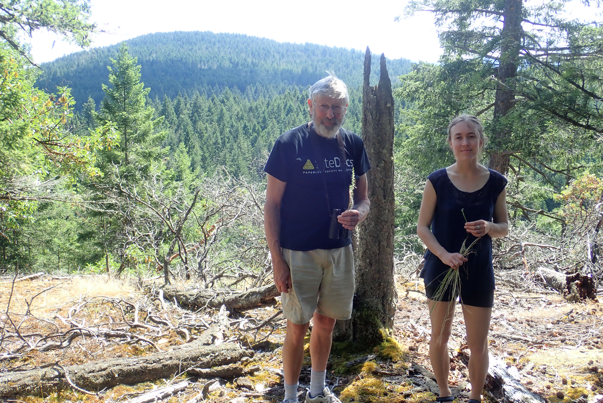

Finally, our study highlights the importance of living knowledge held by collectors, 
such as the late Harvey Janszen, who, before his death, contributed greatly to the project 
and helped us define the extent of historical habitat patches, enabling us to infer the extirpation 
of Crassula and Primula. This outcome is a testament to the fact that human knowledge and memory
of biodiversity are also vulnerable to extinction (Gaston & Soga, 2020; Jarić et al., 2021). 

