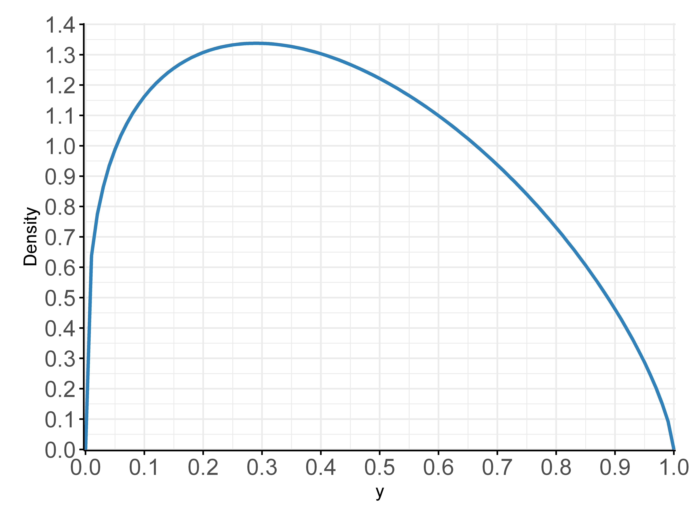

## A convenient choice for rapid Bayesian inference

<p>The beta distribution is a convenient choice for representing Bayesian inference on
a probabilistic quantity such as probability of extirpation or probability of sighting.
It is a distribution on the interval \([0, 1]\) which allows us to quickly estimate
these probabilities and also summarise our confidence of these estimates, represented
by how peaked the distribution is around its maximum.
</p>



```R
make_beta <- function (prob, weight) {
  c(prob * weight, (1 - prob) * weight)
}

# Beta distribution statistics from https://en.wikipedia.org/wiki/Beta_distribution
beta_mean <- function (bf) {
  bf$alpha / (bf$alpha + bf$beta)
}

beta_variance <- function (bf) {
  bf$alpha * bf$beta / ((bf$alpha + bf$beta)^2 * (bf$alpha + bf$beta + 1))
}
```

<p>
  <a class="btn btn-primary" data-bs-toggle="collapse" href="#collapseExample" role="button" aria-expanded="false" aria-controls="collapseExample">
    Expand for mathematical details
  </a>
</p>
<div class="collapse" id="collapseExample">
  <div class="card card-body">
<p>
 We model the probability of a species’ extirpation in a particular area. For consistency with mathematical treatments, we present calculations with a random variable \(θ\)
 encoding the probability of presence in the range \([0, 1]\) and convert to \(1-θ\), the probability of extirpation when we summarise our results. 
 Observations of presence or absence \(y_t\) are governed by a Bernoulli process with parameter \(θ\), where \(p(y_t |θ)=θ\) if \(y_t =1\) represents presence. 
</p>
<p>
Following the notation of Royle and Dorazio (2008), we updated our prior beliefs (prior distribution \(π(θ)\)) using a probabilistic model (likelihood function \(f(y|θ)\)) to derive posterior beliefs (posterior distribution \(π(θ|y)\)). This produces the classical form of Bayes theorem for inference written as:
 $$π(θ|y) ∝ π(θ)f(y|θ)$$ (Equation 1)
</p>
<p>
We modeled the probability of presence by the beta distribution on \([0, 1]\), which is described by two shape parameters \(α\) and \(β\) and takes the form:
                  $$f(y|α,β) ∝ y^{(α-1)} (1-y)^{(β-1)}$$   (Equation 2)
</p>
<p>
This is a convenient choice because, under the Bayesian framework, we can select a conjugate prior within this family, which leads to a posterior distribution in the same family. Given our observations of target species take the form of binary variables (all representing non-detection), these can be placed within a hierarchical Bayesian modeling context where the shape parameters \(α\) and \(β\) represent hyperparameters for our modeled distributions.
</p>
  </div>
</div>