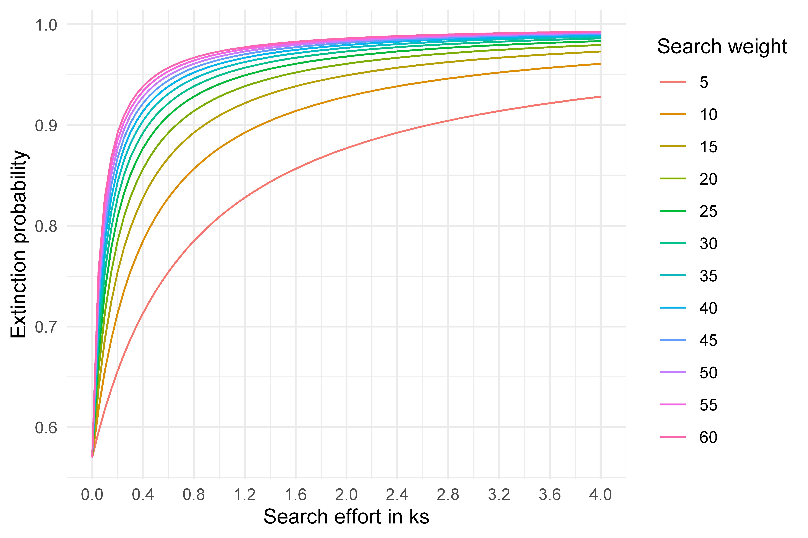

{}
The IUCN defines a taxon as ‘presumed extinct’ “when *exhaustive surveys* in known and/or expected habitat ... 
have failed to record an individual.”
{}

## What constitutes a complete search?

Imagine yourself in a $30\times30\text{ m}$ area: How much time do you think you need to adequately search this area?

There are many factors to consider here, including the size of the target organism, the complexity of its environment, 
search conditions, the surveyor's efficacy, *etc*.. 

This is not a simple geometric problem, or challenge of searching every $m^2$ of an area.
Best practices for species inventory and rare species surveys recommend 
the "intuitive search" as the most effective approach (Canada, Ministry of Environment and Climate Change Strategy, 2018), because species often occupy
specific niches that are unevenly distributed across the landscape.

Unless one has data to calculate detection probabilities, it is not possible to fit a fully probabilistic model 
to solve this problem. Hence, we must resort to a heuristic: how much effort do we 
need to exhaust in an area before we are satisfied that our search is complete?

Our method incorporates a search weight parameter $W_s$ that must be defined to infer
extirpation probability for a given cell. We propose this parameter as a necessary heuristic,
which provides a means of overcoming the impasse posed by alternative modeling approaches
(*e.g.*, MCMC), which are data hungry and cannot be satisfied in this context.

This parameter should ideally be assigned a priori with careful consideration for the
study system or target organism.

  <a class="btn btn-primary" data-bs-toggle="collapse" href="#collapseExample" role="button" aria-expanded="false" aria-controls="collapseExample">
    Expand for mathematical details
  </a>

  

 Under Bayesian inference, our beta distribution parameters on an unsuccessful 
 Bernoulli trial (representing a failure to observe) will update from \((α,β)\) to \((α,β+1)\). 
 However, given the search is a continuous process, we have a free parameter representing 
 the quantity of search effort that represents a discrete “trial”—our search effort \(S_t\)
 in a particular cell results in a posterior update to \((α,β+S_t W_s)\) where \(W_s\) 
 represents the weighting applied to search effort. 
 

 

 This weighting depends on many factors influencing the efficacy of initial 
 intuitively reasoned search efforts, including the searcher's efficiency, 
 the species' detectability, or the search conditions. 
 Hence, this free parameter should be considered in relation to \(W_p\). 
 Our weighting was set by eliciting a defensible level of confidence in extirpation 
 given varying amounts of search effort within a single \(900m^2\) cell, leading to a value 
 \(W_s\) of \(15\).

