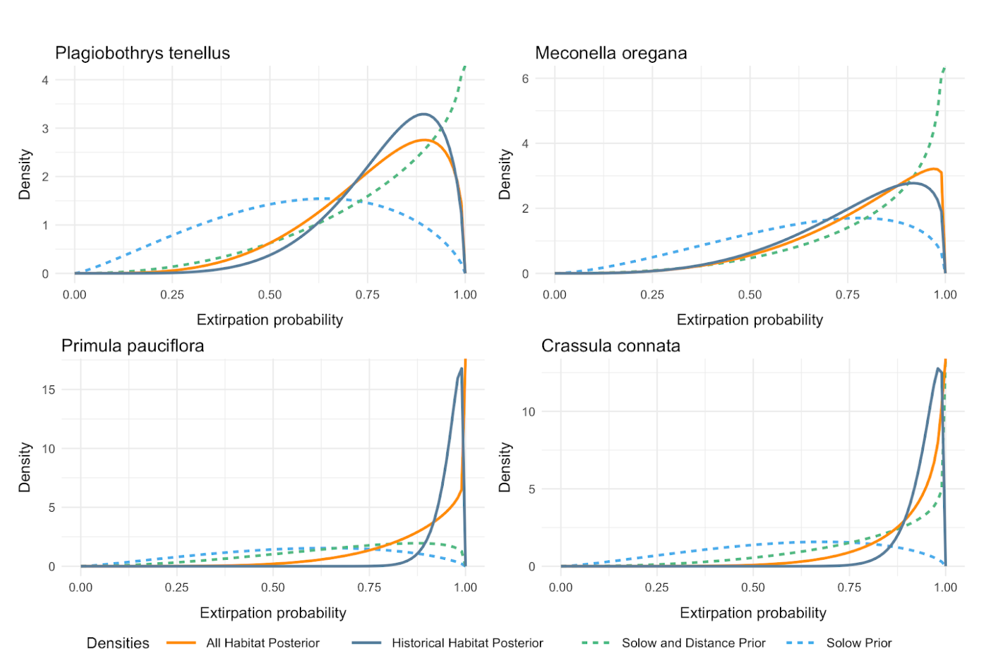

Inference of extirpation in potential habitat proceeds as with inference
for historical habitat, with the additional element to the analysis that our
prior probability of extirpation is modified by a distance kernel, which assigns
decreasing probability of persistence with increasing distance from historical
habitat.

After pooling statistics between cells in historical and potential habitat, 
the distributions for the resulting regional extirpation priors and 
likelihoods appear as follows, as shown in our paper's Figure 3:

