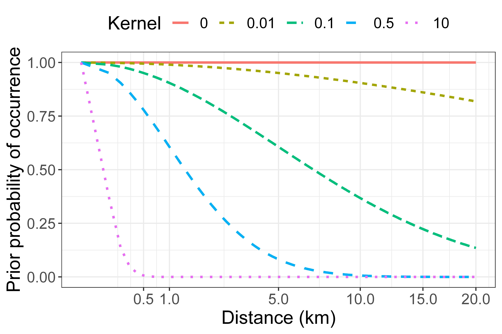

Estimating the likelihood of a plant’s occurrence beyond the extent of its historical habitat presents a Wallacean dilemma, as species often exhibit restricted distributions despite the apparent availability of suitable habitat (Lomolino, Riddle and Brown., 2006). To address this dilemma, we applied the negative exponential distance weighting system widely used in metapopulation ecology to model patch-occupancy dynamics (Hanski, 1994; Hanski et al., 2017; Yeiser et al., 2021; Hanski & Ovaskainen, 2002). This method was chosen for its analytical simplicity, based on the assumption that patch occupancy probabilities decrease with varying distance from historical source populations, depending on the rarity patterns of target plants.

We selected kernel values by linking them with rarity types (Kruckeberg and Rabinowitz, 1985; Crisfield et al., 2024) and then assigning typologies to target species. Kernel assignments were justified by comparing plotted distance decay rates with regional distribution patterns of target plants. Validation was also drawn from comparisons with the observed distance decay rates of detected targets relative to the position of first historical records (Supplementary Materials). This gives rise to a distance-based prior distribution for presence \(P_d = exp(-\gamma d) \) where d represents the distance of the patch from a historical record and \(\gamma\) represents the kernel value. 

