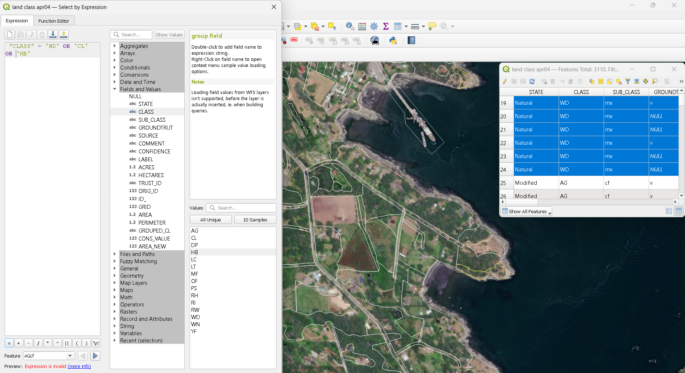

```{r, setup, include=FALSE}
knitr::opts_knit$set(root.dir = rprojroot::find_rstudio_root_file())
knitr::opts_knit$set(render_markdown = FALSE)
```

```{r, echo=FALSE, include=FALSE}
source("R/site_globals.R")
source("scripts/geomUtils.R")
source("scripts/config.R")
library(leaflet)
library(rmarkdown)
library(dplyr)
library(ggplot2)

source("scripts/plotHabitat.R")
```

## Mapping habitat

Habitat can be represented in many ways, ranging from complex species distribution models 
to relatively simple ecosystem mapping or site classification data.



In this tutorial, we use high resolution (1:5,000 scale) site classification mapping 
to map habitat for our target species. This spatial data takes the shape of polygons 
circumscribing different ecosystem types or areas of land use. This versatile approach 
should be accessible to many communities, wherever land classification or terrestrial 
ecosystem mapping data are available. Otherwise, habitat can be mapped based on 
orthoimagery generated using a variety of methods (*e.g.*, satellite, drone).

### Filtering site classification mapping based on habitat types for target species

First, we select the site classifications representing suitable habitat for our targets:
woodlands (WD), cliffs (CL), herbaceous (HB) habitat types. These are extracted as polygons, 
then converted to grid cells.

### Converting polygons to gridded representation of habitat

Polygons representing habitat for target species is then represented as grid cells. 
For this methodology, a key consideration is to ensure that the grid scale corresponds 
with the precision of features representing search effort (see next section).

The map below shows green polygons representing habitat within Bellhouse Park, 
as well as a gridded representation of the same habitat (30x30 m^2 cells).
Assuming _Primula pauciflora_ as our target taxon, we delineate the extent of its historical
habitat based on the best available information (in this case, based on a reasonably accurate GPS
coordinate, knowledge of its habitat type (vernal pools), and first-hand knowledge shared by the collector, Harvey Janszen). The accuracy of this information allows us to select 9 cells from our habitat map to represent the historical
habitat of _Primula_, shown in blue.

```{r echo=FALSE}
historicalHabitat
```

Expanding this grid to the entire island shows the grid for potential habitat:

```{r echo=FALSE}
potentialHabitat
```
